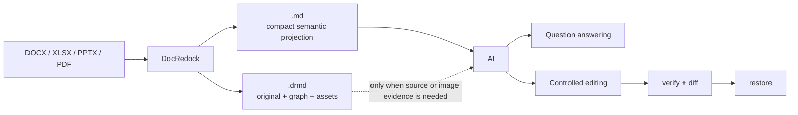
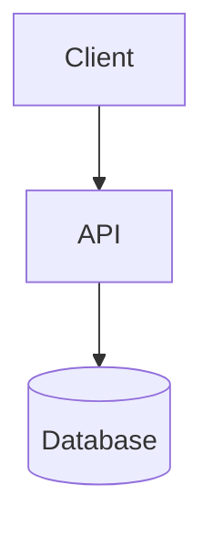

# DocRedock

[日本語ドキュメント](release-docs/README.md) | [English documentation](release-docs/README.en.md)

[](https://github.com/Takayuki-Ishimaru/docredock/releases/tag/v0.1.2)
[Download ready-to-run GUI + CLI](https://github.com/Takayuki-Ishimaru/docredock/releases/tag/v0.1.2) · [Release notes](release-docs/RELEASE_NOTES_v0.1.2.md)

<p align="center">
  
</p>

<picture>
  <source media="(prefers-color-scheme: dark)" srcset="assets/brand/docredock/banners/dark/DocRedock-banner-dark-1200x400.png">
  <source media="(prefers-color-scheme: light)" srcset="assets/brand/docredock/banners/light/DocRedock-banner-light-1200x400.png">
  
</picture>

DocRedock is a local-first round-trip document system for safe Office/PDF and Markdown workflows.
It stores the original binary beside a deterministic canonical `DocumentGraph`
and exposes Markdown as an editable projection, not as a lossless source format.

> [!WARNING]
> **Current internal-evaluation restriction:** PDF conversion/rendering and restoration to original file formats have not been validated sufficiently and may not work. Do not use those functions for now. The approved scope is one-way **Markdown-only** export from DOCX, XLSX, and PPTX.

## Why convert documents to Markdown before asking AI?

Office files spread their meaning across workbook, sheet, cell, relationship,
drawing, and package structures. An AI agent usually has to discover and extract
those parts through repeated tool calls. DocRedock prepares a compact semantic
projection instead: headings become headings, tables become coordinate-aware
Markdown tables, and document structure becomes directly searchable text.



A controlled local-agent benchmark asked the same 12 questions about the same
synthetic system-design workbook, without web search, prebuilt indexes, or
preselected cell ranges:

| AI input | Accuracy | Input tokens | Time | Best use |
| --- | ---: | ---: | ---: | --- |
| `.md` | 11/12 overall; 11/11 for text | 85,915 | 34.9 s | Search, summaries, and text Q&A |
| `.md + .drmd` | 12/12 | 136,555 | 60.0 s | Text plus embedded-image or source evidence |
| `.xlsx` directly | 12/12 | 332,022 | 155.5 s | Editing when native spreadsheet structure itself is required |

In that run, `.md` used **74.1% fewer input tokens** than direct Excel access,
and `.md + .drmd` used **58.9% fewer** while still answering the image-only
question. The practical benefits are:

- 🧠 **Less agent overhead:** the model reads normalized text instead of repeatedly locating sheets, ranges, relationships, and images.
- ⚡ **Lower latency and token use:** less extracted context is reinjected across tool calls.
- 🖼️ **Selective completeness:** use `.md` for text; add `.drmd` only when original bytes, images, OCR evidence, or source anchors matter.
- 🔄 **Safer edits:** explicit capabilities, stable IDs, `verify`, and `diff` make changes reviewable before `restore`.
- 📄 **The original remains authoritative:** Markdown is the AI-facing projection, not a replacement for the Office/PDF source.

These figures are measurements from this fixture and environment, not a universal
performance guarantee. File complexity, tools, model, and question type change
the result. A three-run small-model follow-up showed the same direction while
also showing substantial run-to-run variance. See the
[full benchmark and methodology](docs/AI_DOCUMENT_FORMAT_TOKEN_BENCHMARK_2026-08-25.md).

Brand usage, Dawn color tokens, UI rules, and the asset inventory are documented
in [`docs/BRAND_DESIGN_GUIDELINES.md`](docs/BRAND_DESIGN_GUIDELINES.md).

The repository implements the Phase 0–7 vertical path:

- Canonical Graph 1.1, provenance, source anchors, raw slices, stable IDs,
  deterministic JSON, graph diffing, and explicit deletion semantics;
- strict DRMD Markdown markers, contributor maps, integrity verification,
  `.drmd` directory/zip sidecars, portable `.drmdpkg` pack/unpack, graph chunks,
  assets, OCR evidence, and reports;
- versioned, explicitly registered providers with content-based probing,
  allowlists, bounded input, and no ambient provider discovery;
- format-aware DOCX, XLSX, PPTX, and PDF extraction and restore policies;
- on-device macOS/Windows OCR with local Tesseract fallback, typed Markdown
  rendering, a bounded JSON Lines worker,
  typed orchestration API, CLI, schemas, CI, license allowlist, and SBOM tooling.

## Format support and fidelity

Every operation reports the fidelity it actually achieved:

- **F0**: the verified original bytes are copied unchanged. Derived-only OCR
  corrections also remain F0 because they do not mutate the original layer.
- **F1**: an Office package is patched while untouched content is preserved.
  DOCX supports text in paragraphs/headings/lists, same-shape table cells,
  explicit deletes, supported insertions, and a reversible rich-text subset
  (bold, italic, underline, strike, code, breaks, and tabs). XLSX projects each
  sheet as compact coordinate-addressed GFM tables: empty rows and columns are
  omitted and distant regions are separated. Existing cell values and formulas
  remain restorable; new cells and row/column structure stay protected. PPTX
  projects existing shapes as title/subtitle/body/other and preserves body
  paragraph boundaries when restoring text.
- **F2**: a new document is rendered from a validated template while preserving
  the template's unrelated package parts.
- **F3**: a new standard-layout document is rendered. Edited PDF restore requires
  the explicit `--allow-render-fallback` opt-in and is reported as F3.
- **FX**: the requested change cannot be applied safely and no output is claimed.

Unsupported or protected Office structure is rejected instead of silently
flattened. Examples include XLSX structural edits, PPTX notes/table/image edits,
DOCX protected field boundaries, macros/signatures/protection, and unsafe package
content. PDF extraction is intentionally conservative; scanned-page OCR requires
an injected `IPdfRasterizer` implementation.

## Safety model

- Markdown alone cannot restore the original. Keep the adjacent `.drmd`
  sidecar or a packed `.drmdpkg` bundle.
- Removing a Markdown block is not deletion. Use an explicit
  `<!--drmd:delete ...-->` marker.
- OCR is derived `AnnotationOnly` evidence. `unavailable`, `skipped`, and
  `failed` are explicit states and never masquerade as successful empty text.
- XML DTDs, archive traversal/bombs, symlink escapes, oversized worker requests,
  suspicious formulas, and PDF resource exhaustion are checked at trust boundaries.
- Built-in execution is local-only: it does not fetch network resources, execute
  spreadsheet formulas, or load global plugins implicitly.
- Output paths are not overwritten.
- Office restore treats the original package as the formatting source of truth.
  Markdown edits replace permitted text while preserving DOCX run fonts and page
  layout, XLSX cell styles and row/column layout, and PPTX run fonts, themes, and
  shape geometry.

OCR stays on the local machine. On macOS, DocRedock prefers the on-device Apple
Vision framework through the bundled Swift helper. On Windows, it prefers the
inbox `Windows.Media.Ocr` API through the bundled Windows PowerShell helper.
`jpn`/`eng` are mapped to the corresponding installed Windows recognizer
languages. If the native provider is unavailable, DocRedock falls back to an
optional local Tesseract executable. Tesseract and its language models must be
installed separately. The CLI defaults to `jpn+eng`.
PDF rasterization and OCR language assets are not bundled. The built-in PDF
renderer embeds the SIL OFL-licensed Noto Sans JP font and supports Japanese
and other Unicode text; `RenderOptions.FontPath` can be used to select an
approved replacement font.

## Build and test

The .NET SDK is pinned in `global.json`.

```sh
dotnet restore DocRedock.sln --locked-mode
dotnet build DocRedock.sln -c Release --no-restore
dotnet test tests/DocRedock.Tests/DocRedock.Tests.csproj -c Release --no-build --no-restore
dotnet run --project tools/LicenseAudit -- --root . --output artifacts
```

The license audit validates every locked package against
`licenses/allowlist.json` and emits `artifacts/sbom.cdx.json`.

## Cross-platform GUI

The local GUI is an Avalonia desktop application. It runs the round-trip engine
in the application process, so document conversion does not start a web server
or send documents to a remote service. At startup, the GUI makes one short HTTPS
request to the public GitHub Releases API to check release metadata. It sends no
document content, file name, or local path, never downloads or installs an update
automatically, and ignores update-check failures. The browser opens only when the
user selects the release-page button. The same codebase is published as native
desktop binaries for Windows, macOS, and Linux.

```sh
dotnet run --project src/DocRedock.Gui
```

The GUI has two workflows:

1. Select or drop a DOCX, XLSX, or PPTX and choose **Markdown only** to
   reconstruct headings, paragraphs, metadata, and tables as one `.md` file.
2. **`.md + .drmd` (when future restoration to the original file format may be needed)**
   stores an adjacent sidecar, but restoration is outside the currently approved
   evaluation scope and must not be used yet.

PDF input/output and restoration to original file formats remain visible for development
and evaluation, but they are not supported for current internal use.

Readable Markdown is a one-way reading format and cannot be restored to the
source document. XLSX headings, table boundaries, number formats, and
DrawingML diagrams are best-effort in this profile and should be reviewed.
`.drmd` is the logical sidecar containing the verified original, canonical graph,
maps, assets, and reports. The GUI writes the `.md` and directory-form `.drmd/`
directly to the selected output directory. It can optionally convert the same
sidecar in place to a zip-form `.drmd` file for transport. CLI-created `.drmdpkg`
bundles remain available when one file containing both Markdown and sidecar is needed.
For XLSX, Readable Markdown also reconstructs supported DrawingML layouts as
Mermaid diagrams. The default output is a normal `mermaid` fence so generated
Markdown stays compact; an inline SVG preview is an explicit CLI/GUI opt-in.
DocRedock uses shape text, connector endpoint IDs, anchors, and semantic tables where
available: state-transition tables become `stateDiagram-v2`, sequence layouts
become `sequenceDiagram`, and connected shapes or swimlanes become `flowchart`
diagrams. The underlying diagram cells are not repeated as a coordinate dump in
this one-way profile. Formula text is hidden by default in readable output and
can be enabled when auditing a workbook.

The CLI supports the same repeated-export loop as the GUI: pass `--force` to
replace the requested output only after a staged conversion has completed successfully;
a failed conversion preserves the previous output. Pass `--quiet` to suppress informational diagnostics.
Readable-only controls are `--show-formulas`, `--svg-previews`, `--no-diagrams`,
`--sheets Sheet1,Sheet2`, and `--title "Document title"`.
Embedded Office images are written beside the Markdown in
`<markdown-name>.assets/` and referenced with normal Markdown image syntax.
Pass `--embed-images` with the `readable` profile to produce a self-contained
Markdown file instead: verified PNG, JPEG, GIF, and WebP images up to 10 MiB
each (50 MiB total) are encoded as data URIs and no `.assets/` directory is created. Images
that fail this conservative check are omitted with a warning rather than
leaving an external or unsafe reference.
When OCR is enabled and succeeds, recognized text is emitted immediately after
the related image as an `OCR抽出テキスト` block quote so it is distinguishable
from authored cell or paragraph text.
Files are processed locally. Source documents are limited to 200 MiB, Markdown
to 16 MiB, and DocRedock restore files to 496 MiB. OCR remains optional. It
uses the native macOS or Windows provider first and the local Tesseract fallback
described above when needed.

### The two physical forms of a sidecar

An adjacent `<base>.drmd` is one logical sidecar with two physical forms. The
directory form is intended for editing, preview, and source control. The zip
form is intended for transport and is opened read-only through a temporary
validated extraction. Packing or unpacking a sidecar never changes the bytes of
the adjacent Markdown file, so `roundtrip_store` and image paths remain the same.

To display images in VS Code or GitHub, keep `<base>.md` beside the directory-form
`<base>.drmd/` and commit both. A zip-form `.drmd` cannot expose its internal
images to those renderers; run `docredock unpack <base>.drmd --in-place` before commit.
For XLSX roundtrip exports, anchored images are interleaved with sheet tables at
their source row. Images sharing a row are emitted in source-column order, with
DrawingML dimensions converted to responsive HTML image dimensions.
Do not copy this repository's `.gitignore` rule for `.drmd` into a repository
where rendered images must be visible. For large originals, only the retained
source payload can be placed in Git LFS, for example:

```gitattributes
**/*.drmd/source/** filter=lfs diff=lfs merge=lfs -text
```

The [Public Beta releases](https://github.com/Takayuki-Ishimaru/docredock/releases)
provide ready-to-run packages for all six targets. Each archive includes the
branded GUI, CLI, Japanese and English quick starts, security/privacy guidance,
licenses, artifact-file checksums, an artifact-linked SBOM, provenance metadata,
and an explicit signing-status record; users do not need the .NET SDK. The
release page also provides release-level checksums, SBOM/provenance, and automated
release evidence. The macOS archive contains a proper `DocRedock.app` bundle with
the app icon, Windows embeds the application icon in the executable, and Linux
includes a PNG icon and desktop entry.

Developers can publish raw self-contained executables locally with either script:

```sh
# macOS/Linux shell: one target, or omit the RID to publish every target
sh tools/publish-gui.sh osx-arm64

# PowerShell on Windows/macOS/Linux
./tools/publish-gui.ps1 -RuntimeIds win-x64
```

Supported runtime identifiers are `win-x64`, `win-arm64`, `osx-x64`,
`osx-arm64`, `linux-x64`, and `linux-arm64`. Raw developer output is written
under `artifacts/gui/<runtime-id>/`; start `DocRedock.exe` on Windows or
`DocRedock` on macOS/Linux. The release workflow performs the platform packaging
and attaches the final archives to GitHub Releases. Code signing and Apple
notarization are optional during the current beta and their absence does not block
a release. Each archive records whether signing/notarization was applied. For
company-wide rollout, prefer a managed internal distribution channel and review
the published SHA-256 checksums and signing status.

## CLI

The CLI can also be published as a self-contained single executable, so end
users do not need the .NET SDK or `dotnet run`:

```sh
# macOS/Linux shell: one target, or omit the RID to publish every target
sh tools/publish-cli.sh osx-arm64

# PowerShell on Windows/macOS/Linux
./tools/publish-cli.ps1 -RuntimeIds win-x64
```

Output is written under `artifacts/cli/<runtime-id>/`; run `DocRedock.Cli.exe` on
Windows or `DocRedock.Cli` on macOS/Linux. The same six runtime identifiers listed
for the GUI are supported.

```sh
# Create one human-readable Markdown file (no .drmd or .drmdpkg sidecar)
dotnet run --project src/DocRedock.Cli -- export input.xlsx --profile readable --output input.md --ocr off --quiet

# Embed verified Office images into the Markdown file (no input.assets directory)
dotnet run --project src/DocRedock.Cli -- export input.xlsx --profile readable --output input.md --embed-images

# Replace an existing projection deliberately (export is non-destructive by default)
dotnet run --project src/DocRedock.Cli -- export input.xlsx --profile readable --output input.md --force

# Create editable Markdown and an adjacent source-preserving .drmd sidecar
dotnet run --project src/DocRedock.Cli -- export input.docx --profile roundtrip --output input.md --ocr auto

# Choose a zip-form sidecar during export, or convert an existing sidecar in place
dotnet run --project src/DocRedock.Cli -- export input.docx --profile roundtrip --output input.md --sidecar zip
dotnet run --project src/DocRedock.Cli -- pack input.md --sidecar --in-place
dotnet run --project src/DocRedock.Cli -- unpack input.drmd --in-place

# Inspect, diff, validate, and restore
dotnet run --project src/DocRedock.Cli -- inspect input.md
dotnet run --project src/DocRedock.Cli -- diff input.md
dotnet run --project src/DocRedock.Cli -- verify input.md
dotnet run --project src/DocRedock.Cli -- restore input.md --output restored.docx --strict

# Render a new document (optionally from a validated template)
dotnet run --project src/DocRedock.Cli -- render input.md --format pdf --output rendered.pdf
dotnet run --project src/DocRedock.Cli -- render input.md --format docx --template template.docx --output rendered.docx

# Rebase without changing the old baseline, or transport a complete workspace
dotnet run --project src/DocRedock.Cli -- rebase input.md --source revised.docx
dotnet run --project src/DocRedock.Cli -- pack input.md --output input.drmdpkg
dotnet run --project src/DocRedock.Cli -- verify input.drmdpkg

# Verify the resolved development dependency licenses
dotnet run --project src/DocRedock.Cli -- licenses --verify

# Print the exact editing contract to include in an AI prompt/context
dotnet run --project src/DocRedock.Cli -- rules
```

### Mermaid diagrams in rendered documents

Generic Markdown passed to `render` may contain fenced Mermaid blocks. DocRedock
renders each block to a local PNG and embeds it as a native image in DOCX,
PPTX, XLSX, or PDF output instead of printing the Mermaid source as code.

````md
# Request flow


````

Install the external [Mermaid CLI](https://github.com/mermaid-js/mermaid-cli)
locally, or point DocRedock to an existing directly executable `mmdc` wrapper:

```sh
npm install -g @mermaid-js/mermaid-cli
dotnet run --project src/DocRedock.Cli -- render input.md --format docx --mermaid-cli /path/to/mmdc --output rendered.docx
```

The CLI is invoked only when a `mermaid` fence is present. DocRedock does not use a
shell, does not download Mermaid at runtime, supplies Mermaid's strict security
configuration, rejects URL/data/file references and init directives, limits a
document to 32 diagrams, and validates the generated PNG before embedding it.
For XLSX, diagrams are placed below the populated table/text area, one diagram
per height-adjusted row, using one-cell DrawingML anchors. DOCX, PPTX, and XLSX
Office templates may be combined with Mermaid: DocRedock preserves existing package
parts, assigns collision-free relationship IDs and part names, and merges the
generated PNG, DrawingML, relationship, and content-type dependencies. PDF
templates remain unsupported. This is a new-document `render` feature and does
not add or replace drawings in the source-preserving `restore` workflow.

Other commands are `unpack` and schema-1.1 `migrate`. Export profiles are
`readable`, `roundtrip`, and `audit`. `readable` is presentation-oriented and
one-way; `roundtrip` and `audit` retain source coordinates and restore data.
Clean new Office/PDF output is produced by `render`, never by `restore`.
The export CLI refuses to replace an existing Markdown or `.drmd` sidecar by
default; pass `--force` when replacement is intentional. `--quiet` suppresses
informational per-formula diagnostics while retaining warnings and errors.

PDF readable extraction is conservative: font/CMap-heavy PDFs may fail or
produce incomplete text. Formula results are never evaluated by DocRedock. Review
readable output before sharing when the source uses unusual spreadsheet
layouts, unstyled tables, or embedded diagrams.

DRMD Markdownを人間またはAIが編集する際の現行契約は、
[`docs/DRMD_MARKDOWN_SPEC.md`](docs/DRMD_MARKDOWN_SPEC.md)、
[`docs/DRMD_AI_EDITING_RULES.md`](docs/DRMD_AI_EDITING_RULES.md)、
[`docs/FORMAT_CAPABILITY_MATRIX.md`](docs/FORMAT_CAPABILITY_MATRIX.md)を参照してください。

## Repository layout

- `DocRedock.Core`: graph, deterministic serialization, diff, fidelity reports
- `DocRedock.Markdown` / `DocRedock.RoundTrip`: projection and source-preserving workspace
- `DocRedock.Formats.OpenXml` / `DocRedock.Formats.Pdf`: built-in format adapters
- `DocRedock.Ocr.Tesseract` / `DocRedock.Render`: derived OCR and new-document rendering
- `DocRedock.Api` / `DocRedock.Worker` / `DocRedock.Cli`: orchestration and process boundaries
- `schemas`, `tests`, `tools/LicenseAudit`: contracts and quality gates

## License

DocRedock is released under the [MIT License](LICENSE). See [THIRD-PARTY-NOTICES.txt](THIRD-PARTY-NOTICES.txt) for third-party dependencies and bundled assets.
