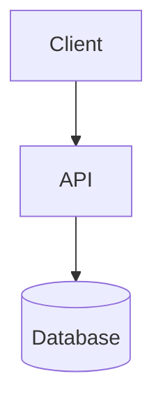

# RoundHound


RoundHound is a local-first round-trip document system based on the v0.2 architecture.
It stores the original binary beside a deterministic canonical `DocumentGraph`
and exposes Markdown as an editable projection, not as a lossless source format.

Brand usage, Dawn color tokens, UI rules, and the asset inventory are documented
in [`docs/BRAND_DESIGN_GUIDELINES.md`](docs/BRAND_DESIGN_GUIDELINES.md).

The repository implements the Phase 0–7 vertical path:

- Canonical Graph 1.1, provenance, source anchors, raw slices, stable IDs,
  deterministic JSON, graph diffing, and explicit deletion semantics;
- strict RTMD Markdown markers, contributor maps, integrity verification,
  portable `.rtmdpkg` pack/unpack, graph chunks, assets, OCR evidence, and reports;
- versioned, explicitly registered providers with content-based probing,
  allowlists, bounded input, and no ambient provider discovery;
- format-aware DOCX, XLSX, PPTX, and PDF extraction and restore policies;
- local Tesseract OCR, typed Markdown rendering, a bounded JSON Lines worker,
  typed orchestration API, CLI, schemas, CI, license allowlist, and SBOM tooling.

## Format support and fidelity

Every operation reports the fidelity it actually achieved:

- **F0**: the verified original bytes are copied unchanged. Derived-only OCR
  corrections also remain F0 because they do not mutate the original layer.
- **F1**: an Office package is patched while untouched content is preserved.
  DOCX supports text in paragraphs/headings/lists, same-shape table cells,
  explicit deletes, supported insertions, and a reversible rich-text subset
  (bold, italic, underline, strike, code, breaks, and tabs). XLSX projects each
  sheet as compact coordinate-addressed GFM tables: empty rows and columns are
  omitted and distant regions are separated. Existing cell values and formulas
  remain restorable; new cells and row/column structure stay protected. PPTX
  projects existing shapes as title/subtitle/body/other and preserves body
  paragraph boundaries when restoring text.
- **F2**: a new document is rendered from a validated template while preserving
  the template's unrelated package parts.
- **F3**: a new standard-layout document is rendered. Edited PDF restore requires
  the explicit `--allow-render-fallback` opt-in and is reported as F3.
- **FX**: the requested change cannot be applied safely and no output is claimed.

Unsupported or protected Office structure is rejected instead of silently
flattened. Examples include XLSX structural edits, PPTX notes/table/image edits,
DOCX protected field boundaries, macros/signatures/protection, and unsafe package
content. PDF extraction is intentionally conservative; scanned-page OCR requires
an injected `IPdfRasterizer` implementation.

## Safety model

- Markdown alone cannot restore the original. Keep the adjacent `.rtmd`
  workspace or a packed `.rtmdpkg`.
- Removing a Markdown block is not deletion. Use an explicit
  `<!--rtmd:delete ...-->` marker.
- OCR is derived `AnnotationOnly` evidence. `unavailable`, `skipped`, and
  `failed` are explicit states and never masquerade as successful empty text.
- XML DTDs, archive traversal/bombs, symlink escapes, oversized worker requests,
  suspicious formulas, and PDF resource exhaustion are checked at trust boundaries.
- Built-in execution is local-only: it does not fetch network resources, execute
  spreadsheet formulas, or load global plugins implicitly.
- Output paths are not overwritten.
- Office restore treats the original package as the formatting source of truth.
  Markdown edits replace permitted text while preserving DOCX run fonts and page
  layout, XLSX cell styles and row/column layout, and PPTX run fonts, themes, and
  shape geometry.

Tesseract is optional and discovered as a local executable. The CLI defaults to
`jpn+eng`; the executable and language models must be installed separately.
On macOS, if Tesseract is unavailable, RoundHound falls back to the on-device Apple
Vision framework through the bundled Swift helper when the local Swift runtime
is available. Images and recognized text remain on the machine.
PDF rasterization and native OCR assets are not bundled. The built-in PDF
renderer embeds the SIL OFL-licensed Noto Sans JP font and supports Japanese
and other Unicode text; `RenderOptions.FontPath` can be used to select an
approved replacement font.

## Build and test

The .NET SDK is pinned in `global.json`.

```sh
dotnet restore Rtmd.sln --locked-mode
dotnet build Rtmd.sln -c Release --no-restore
dotnet test tests/Rtmd.Tests/Rtmd.Tests.csproj -c Release --no-build --no-restore
dotnet run --project tools/LicenseAudit -- --root . --output artifacts
```

The license audit validates every locked package against
`licenses/allowlist.json` and emits `artifacts/sbom.cdx.json`.

## Cross-platform GUI

The local GUI is an Avalonia desktop application. It runs the round-trip engine
in the application process, so it does not start a web server, open a browser,
or send documents to a remote service. The same codebase is published as native
desktop binaries for Windows, macOS, and Linux.

```sh
dotnet run --project src/Rtmd.Gui
```

The GUI has two workflows:

1. Select or drop a DOCX, XLSX, PPTX, or PDF. The default **Readable Markdown**
   mode reconstructs headings, paragraphs, metadata, and tables and writes one
   `.md` file. Turn that mode off to save the editable round-trip `.md` plus a
   portable `.rtmdpkg` restore-information file.
2. Select or drop the edited `.md` and its `.rtmdpkg` together and save the
   restored Office/PDF file after integrity verification and graph-aware
   diffing.

Readable Markdown is a one-way reading format and cannot be restored to the
source document. XLSX headings, table boundaries, number formats, and
DrawingML diagrams are best-effort in this profile and should be reviewed.
`.rtmdpkg` is the single-file transport form of the adjacent `.rtmd` workspace;
it contains the verified original, canonical graph, maps, assets, and reports.
The GUI builds that workspace in temporary storage, removes it after packaging,
and leaves only the `.md` and `.rtmdpkg` files in the selected output directory.
For XLSX, Readable Markdown also reconstructs supported DrawingML layouts as
Mermaid diagrams. The default output is a normal `mermaid` fence so generated
Markdown stays compact; an inline SVG preview is an explicit CLI/GUI opt-in.
RoundHound uses shape text, connector endpoint IDs, anchors, and semantic tables where
available: state-transition tables become `stateDiagram-v2`, sequence layouts
become `sequenceDiagram`, and connected shapes or swimlanes become `flowchart`
diagrams. The underlying diagram cells are not repeated as a coordinate dump in
this one-way profile. Formula text is hidden by default in readable output and
can be enabled when auditing a workbook.

The CLI supports the same repeated-export loop as the GUI: pass `--force` to
replace the requested output and `--quiet` to suppress informational diagnostics.
Readable-only controls are `--show-formulas`, `--svg-previews`, `--no-diagrams`,
`--sheets Sheet1,Sheet2`, and `--title "Document title"`.
Embedded Office images are written beside the Markdown in
`<markdown-name>.assets/` and referenced with normal Markdown image syntax.
Pass `--embed-images` with the `readable` profile to produce a self-contained
Markdown file instead: verified PNG, JPEG, GIF, and WebP images up to 10 MiB
each (50 MiB total) are encoded as data URIs and no `.assets/` directory is created. Images
that fail this conservative check are omitted with a warning rather than
leaving an external or unsafe reference.
When OCR is enabled and succeeds, recognized text is emitted immediately after
the related image as an `OCR抽出テキスト` block quote so it is distinguishable
from authored cell or paragraph text.
Files are processed locally. Source documents are limited to 200 MiB, Markdown
to 16 MiB, and RTMD packages to 496 MiB. OCR remains optional. It uses a local
Tesseract installation with the selected language data, or the local Apple
Vision fallback described above on macOS.

Self-contained GUI builds do not require users to install .NET. Publish one
target or all six supported targets with either script:

```sh
# macOS/Linux shell: one target, or omit the RID to publish every target
sh tools/publish-gui.sh osx-arm64

# PowerShell on Windows/macOS/Linux
./tools/publish-gui.ps1 -RuntimeIds win-x64
```

Supported runtime identifiers are `win-x64`, `win-arm64`, `osx-x64`,
`osx-arm64`, `linux-x64`, and `linux-arm64`. Output is written under
`artifacts/gui/<runtime-id>/`; start `RoundHound.exe` on Windows or `RoundHound` on
macOS/Linux. Each build is a self-contained single-file desktop application.
The scripts publish the executable; they do not create a macOS `.app` bundle,
code signature, or installer. On macOS, run the published executable from a
terminal (or wrap it in an application bundle as a separate packaging step).

## CLI

The CLI can also be published as a self-contained single executable, so end
users do not need the .NET SDK or `dotnet run`:

```sh
# macOS/Linux shell: one target, or omit the RID to publish every target
sh tools/publish-cli.sh osx-arm64

# PowerShell on Windows/macOS/Linux
./tools/publish-cli.ps1 -RuntimeIds win-x64
```

Output is written under `artifacts/cli/<runtime-id>/`; run `Rtmd.Cli.exe` on
Windows or `Rtmd.Cli` on macOS/Linux. The same six runtime identifiers listed
for the GUI are supported.

```sh
# Create one human-readable Markdown file (no .rtmd or .rtmdpkg sidecar)
dotnet run --project src/Rtmd.Cli -- export input.xlsx --profile readable --output input.md --ocr off --quiet

# Embed verified Office images into the Markdown file (no input.assets directory)
dotnet run --project src/Rtmd.Cli -- export input.xlsx --profile readable --output input.md --embed-images

# Replace an existing projection deliberately (export is non-destructive by default)
dotnet run --project src/Rtmd.Cli -- export input.xlsx --profile readable --output input.md --force

# Create editable Markdown and an adjacent source-preserving workspace
dotnet run --project src/Rtmd.Cli -- export input.docx --profile roundtrip --output input.md --ocr auto

# Inspect, diff, validate, and restore
dotnet run --project src/Rtmd.Cli -- inspect input.md
dotnet run --project src/Rtmd.Cli -- diff input.md
dotnet run --project src/Rtmd.Cli -- verify input.md
dotnet run --project src/Rtmd.Cli -- restore input.md --output restored.docx --strict

# Render a new document (optionally from a validated template)
dotnet run --project src/Rtmd.Cli -- render input.md --format pdf --output rendered.pdf
dotnet run --project src/Rtmd.Cli -- render input.md --format docx --template template.docx --output rendered.docx

# Rebase without changing the old baseline, or transport a complete workspace
dotnet run --project src/Rtmd.Cli -- rebase input.md --source revised.docx
dotnet run --project src/Rtmd.Cli -- pack input.md --output input.rtmdpkg
dotnet run --project src/Rtmd.Cli -- verify input.rtmdpkg

# Verify the resolved development dependency licenses
dotnet run --project src/Rtmd.Cli -- licenses --verify

# Print the exact editing contract to include in an AI prompt/context
dotnet run --project src/Rtmd.Cli -- rules
```

### Mermaid diagrams in rendered documents

Generic Markdown passed to `render` may contain fenced Mermaid blocks. RoundHound
renders each block to a local PNG and embeds it as a native image in DOCX,
PPTX, XLSX, or PDF output instead of printing the Mermaid source as code.

````md
# Request flow


````

Install the external [Mermaid CLI](https://github.com/mermaid-js/mermaid-cli)
locally, or point RoundHound to an existing directly executable `mmdc` wrapper:

```sh
npm install -g @mermaid-js/mermaid-cli
dotnet run --project src/Rtmd.Cli -- render input.md --format docx --mermaid-cli /path/to/mmdc --output rendered.docx
```

The CLI is invoked only when a `mermaid` fence is present. RoundHound does not use a
shell, does not download Mermaid at runtime, supplies Mermaid's strict security
configuration, rejects URL/data/file references and init directives, limits a
document to 32 diagrams, and validates the generated PNG before embedding it.
For XLSX, diagrams are placed below the populated table/text area, one diagram
per height-adjusted row, using one-cell DrawingML anchors. DOCX, PPTX, and XLSX
Office templates may be combined with Mermaid: RoundHound preserves existing package
parts, assigns collision-free relationship IDs and part names, and merges the
generated PNG, DrawingML, relationship, and content-type dependencies. PDF
templates remain unsupported. This is a new-document `render` feature and does
not add or replace drawings in the source-preserving `restore` workflow.

Other commands are `unpack` and schema-1.1 `migrate`. Export profiles are
`readable`, `roundtrip`, and `audit`. `readable` is presentation-oriented and
one-way; `roundtrip` and `audit` retain source coordinates and restore data.
Clean new Office/PDF output is produced by `render`, never by `restore`.
The export CLI refuses to replace an existing Markdown or `.rtmd` workspace by
default; pass `--force` when replacement is intentional. `--quiet` suppresses
informational per-formula diagnostics while retaining warnings and errors.

PDF readable extraction is conservative: font/CMap-heavy PDFs may fail or
produce incomplete text. Formula results are never evaluated by RoundHound. Review
readable output before sharing when the source uses unusual spreadsheet
layouts, unstyled tables, or embedded diagrams.

RTMD Markdownを人間またはAIが編集する際の現行契約は、
[`docs/RTMD_MARKDOWN_SPEC.md`](docs/RTMD_MARKDOWN_SPEC.md)、
[`docs/RTMD_AI_EDITING_RULES.md`](docs/RTMD_AI_EDITING_RULES.md)、
[`docs/FORMAT_CAPABILITY_MATRIX.md`](docs/FORMAT_CAPABILITY_MATRIX.md)を参照してください。

## Repository layout

- `Rtmd.Core`: graph, deterministic serialization, diff, fidelity reports
- `Rtmd.Markdown` / `Rtmd.RoundTrip`: projection and source-preserving workspace
- `Rtmd.Formats.OpenXml` / `Rtmd.Formats.Pdf`: built-in format adapters
- `Rtmd.Ocr.Tesseract` / `Rtmd.Render`: derived OCR and new-document rendering
- `Rtmd.Api` / `Rtmd.Worker` / `Rtmd.Cli`: orchestration and process boundaries
- `schemas`, `tests`, `tools/LicenseAudit`: contracts and quality gates
