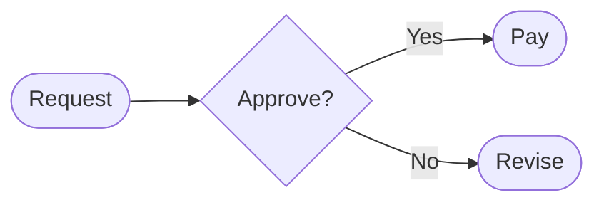

# expense-approval

## Slide 1 — **Expense approval**

```mermaid
flowchart LR
    v_5([Pay])
    v_4{Approve?}
    v_3([Request])
    v_6([Revise])
    v_4 -->|Yes| v_5
    v_3 --> v_4
    v_4 -->|No| v_6
```
