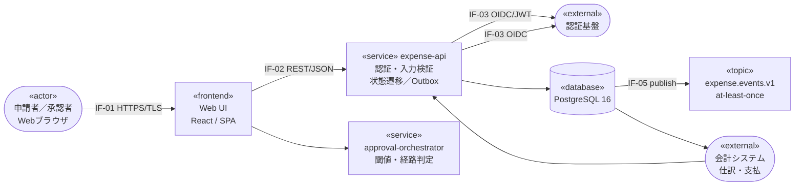
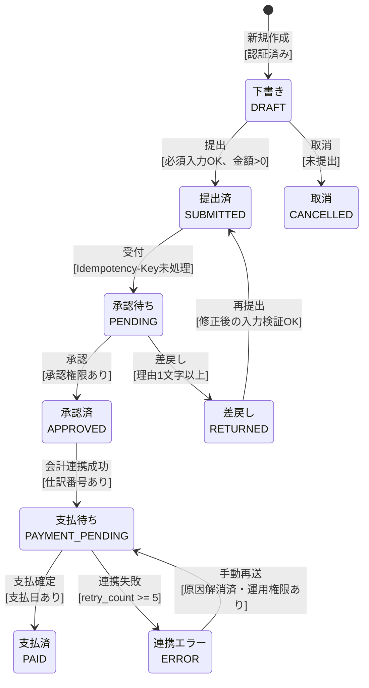
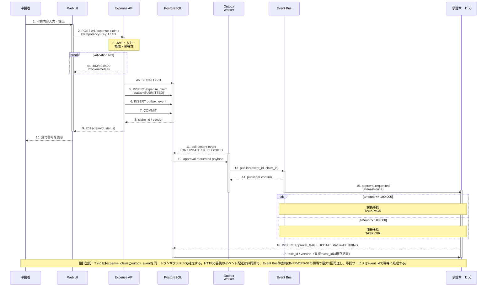
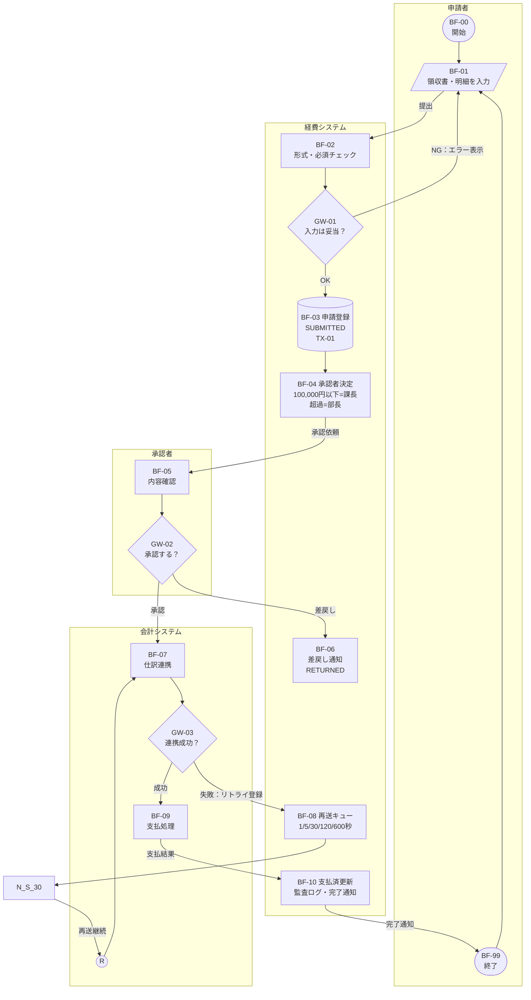

# 経費精算システム 基本・詳細設計書

## 00 表紙・改訂

<!-- inferred: セル配置から文書情報セクションを推定 -->
### 文書情報

検証用サンプル（架空システム）

| 文書番号 | EXPS-DES-001 | 版 | 1.2 |
| --- | --- | --- | --- |
| 作成日 | 2026-08-23 | 状態 | レビュー中（検証用） |
| 対象システム | 経費精算システム | 機密区分 | 社内一般（架空） |
| 作成者 | アプリ設計担当 | 確認者 | 業務・基盤担当 |

### 1. 文書の目的

設計書解析・図形認識・表構造抽出・日本語文書処理の検証入力として使用する。Excel方眼紙の体裁を再現しつつ、状態遷移、シーケンス、業務フロー、画面入力、API／データ、テスト観点を相互参照できるようにした。

### 2. 収録シート

|  | 01 | システム概要 | 前提・構成・非機能要件 |
| --- | --- | --- | --- |
|  | 02 | 振る舞い図 | 申請状態とイベント／ガード条件 |
|  | 03 | シーケンス図 | 申請提出時の同期・非同期連携 |
|  | 04 | 業務フロー | 申請から支払までのスイムレーン |
|  | 05 | 画面・入力仕様 | 入力項目・検証ルール・試験入力 |
|  | 06 | API・データ | API I/F、主要テーブル、状態コード |
|  | 07 | テストシナリオ | 図面パスを網羅する検証ケース |
|  | 08 | 非機能・運用 | SLO・性能・監視・障害対応・未決事項 |
|  | 99 | 凡例・参考 | 図形の意味と調査出典 |

### 3. 改訂履歴

|  | 版 | 日付 | 変更内容 | 作成者 |
| --- | --- | --- | --- | --- |
|  | 0.1 | 2026-08-23 | 初版ドラフト作成 | Codex |
|  | 1.0 | 2026-08-23 | 図形・相互参照・検証用入力を整備 | Codex |
|  | 1.1 | 2026-08-23 | 図形端点・ライフライン・折返し経路を精密化 | Codex |
|  | 1.2 | 2026-08-23 | 文書管理・Outbox・運用設計・追跡性を実案件相当に補強 | 設計担当 |

### 4. レビュー・承認欄

|  | 区分 | 担当 | 確認日 | 結果 |
| --- | --- | --- | --- | --- |
|  | 作成 | アプリ設計担当 | 2026-08-23 | 完了 |
|  | レビュー | 業務／基盤担当 | 2026-08-23 | 条件付承認 |
|  | 承認 | プロジェクト責任者 | — | 未承認 |

## 01 システム概要

| 対象：経費申請の登録、承認、会計連携、支払結果通知 |  |  |  |  |
| --- | --- | --- | --- | --- |
| 文書ID: EXPS-DES-01 | 版: 1.2 | 状態: レビュー中 | 主管: 業務システム部 | 更新: 2026-08-23 |

### 1.1 設計前提

|  | 利用者 | 申請者、課長／部長承認者、経理担当者 |
| --- | --- | --- |
|  | 認証 | OIDC／JWT。Web UIはアクセストークンをAPIへ送信 |
|  | 金額閾値 | 100,000円以下：課長承認、100,000円超：部長承認 |
|  | 領収書 | 10,000円以上では添付必須。PDF/JPEG/PNG、最大10MB |
|  | 可用性 | 平日 8:00–22:00、月間稼働率99.9%を目標 |

### 1.2 システム構成・外部連携



ADR-001：業務整合性と状態更新はExpense APIに集約する。DB更新とイベント生成はTX-01で同時確定し、外部通知・会計連携はOutbox＋冪等コンシューマで再送可能にする。

### 1.3 外部I/F・障害設計

|  | I/F ID | 送信元 | 送信先 | 方式 | Timeout | Retry | 失敗時の扱い |
| --- | --- | --- | --- | --- | --- | --- | --- |
|  | IF-01 | Browser | Web UI | HTTPS/TLS1.2+ | 30秒 | なし | 画面に再操作案内 |
|  | IF-02 | Web UI | Expense API | REST/JSON | 3秒 | 1回 | Idempotency-Keyで安全に再送 |
|  | IF-03 | Expense API | 認証基盤 | OIDC/JWT | 2秒 | なし | 401、認証画面へ遷移 |
|  | IF-04 | Expense API | 承認Service | 内部REST | 2秒 | 2回 | Outboxへ退避、PENDING維持 |
|  | IF-05 | Outbox Worker | Event Bus | AMQP | 5秒 | 最大5回 | DLQ、OPS-ALM-02発報 |
|  | IF-06 | Expense API | 会計System | REST/Batch | 10秒 | 最大5回 | ERROR遷移、手動再送 |
|  | 責任分界：IF-01〜05は当システム主管、IF-06の接続先仕様・停止時間帯は会計システム主管。詳細SLO・運用手順は08_非機能・運用を参照。 |  |  |  |  |  |  |

### 1.4 設計サマリー

- API本数 — 7 — テスト件数 — 9 — 状態数 — 9

## 02 振る舞い図

### 02 振る舞い図（申請状態遷移）

| 角丸＝状態、矢印＝イベント、[ ]＝ガード条件。状態更新はExpense APIのみが実施する。 |  |  |  |  |
| --- | --- | --- | --- | --- |
| 文書ID: EXPS-DES-02 | 版: 1.2 | 状態: レビュー中 | 主管: 業務システム部 | 更新: 2026-08-23 |

### 2.1 状態遷移図



重要な不変条件：PAIDから他状態へは遷移しない／同一Idempotency-Keyの再送で二重登録しない／取消はDRAFTに限る／ERRORは運用権限でのみ再送可能。

### 2.2 状態・イベント定義

| 遷移ID | 遷移元 | イベント | ガード／条件 | 遷移先 | 副作用 |
| --- | --- | --- | --- | --- | --- |
| TR-01 | — | 新規作成 | 認証済み | DRAFT | 一時保存領域作成 |
| TR-02 | DRAFT | 提出 | 必須入力OK、金額>0 | SUBMITTED | 監査ログ記録 |
| TR-03 | SUBMITTED | 受付 | Idempotency-Key未処理 | PENDING | 承認イベント発行 |
| TR-04 | PENDING | 承認 | 承認権限あり | APPROVED | 承認日時を記録 |
| TR-05 | PENDING | 差戻し | 理由1文字以上 | RETURNED | 申請者へ通知 |
| TR-06 | RETURNED | 再提出 | 修正後の入力検証OK | SUBMITTED | 版番号を加算 |
| TR-07 | APPROVED | 会計連携成功 | 仕訳番号あり | PAYMENT_PENDING | 仕訳番号を保存 |
| TR-08 | PAYMENT_PENDING | 支払確定 | 支払日あり | PAID | 完了通知 |
| TR-09 | PAYMENT_PENDING | 連携失敗 | retry_count >= 5 | ERROR | DLQ登録・運用アラート |
| TR-10 | ERROR | 手動再送 | 原因解消済・運用権限あり | PAYMENT_PENDING | retry_countを0へ戻す |
| TR-11 | DRAFT | 取消 | 未提出 | CANCELLED | 論理削除 |

## 03 シーケンス図

### 03 シーケンス図（経費申請の提出）

| SQ-01。同期応答とOutbox後続処理を分離し、トランザクション境界・異常終了・非同期再送を明示する。 |  |  |  |  |
| --- | --- | --- | --- | --- |
| 文書ID: EXPS-DES-03 | 版: 1.2 | 状態: レビュー中 | 主管: 業務システム部 | 更新: 2026-08-23 |

### 3.1 SQ-01 申請受付〜承認タスク生成



## 04 業務フロー

### 04 業務フロー（申請〜支払）

| BF-01。責任主体、判断条件、状態更新、再送・運用移管までをエンドツーエンドで示す。 |  |  |  |  |
| --- | --- | --- | --- | --- |
| 文書ID: EXPS-DES-04 | 版: 1.2 | 状態: レビュー中 | 主管: 業務システム部 | 更新: 2026-08-23 |

### 4.1 エンドツーエンド業務フロー



> 補足：Rは同一ページ内の再送経路コネクタ。失敗時は指数バックオフで最大5回再送し、恒久失敗はデッドレター化して経理担当者へアラートを送る。

### 4.2 業務ルール・責任分界

| ルールID | 条件／判断 | 責任者 | 証跡・参照先 |
| --- | --- | --- | --- |
| BR-01 | 10万円以下は課長、超過は部長承認 | 業務主管 | approval_task.route_code |
| BR-02 | 差戻し理由は1文字以上500文字以下 | 承認者 | audit_log / TR-05 |
| BR-03 | 会計連携5回失敗でERROR・DLQへ移管 | 経理／運用 | TR-09 / OPS-ALM-02 |
| SCOPE-01 | 銀行振込指示と入金消込は対象外 | 会計システム主管 | IF-06責任分界 |

## 05 画面・入力仕様

| 画面ID：EXP-ENTRY-01 経費申請入力。青字セルは検証用に編集可能。 |  |  |  |  |
| --- | --- | --- | --- | --- |
| 文書ID: EXPS-DES-05 | 版: 1.2 | 状態: レビュー中 | 主管: 業務システム部 | 更新: 2026-08-23 |

### 5.1 画面イメージ

|  | 経費申請入力 |  |  |  |  |
| --- | --- | --- | --- | --- | --- |
|  |  | 申請日 * |  | 2026-08-23 |  |
|  |  | 部門コード * |  | D1001 |  |
|  |  | 摘要 * |  | 顧客訪問の交通費 |  |
|  |  | 金額 * |  | 12,800 円 |  |
|  |  | 税区分 * |  | 10% |  |
|  |  | 領収書 |  | 有 |  |
|  |  |  | 一時保存 |  | 申請する |

### 5.2 項目定義・検証ルール

| 項目ID | 項目名 | 型／桁 | 必須 | 検証ルール | エラーコード |
| --- | --- | --- | --- | --- | --- |
| F-01 | 申請日 | date | ○ | 当日以前、過去1年以内 | EXP-E001 |
| F-02 | 部門コード | char(5) | ○ | 部門マスタに存在 | EXP-E002 |
| F-03 | 摘要 | varchar(100) | ○ | 1〜100文字、制御文字不可 | EXP-E003 |
| F-04 | 金額 | integer | ○ | 1〜9,999,999円 | EXP-E004 |
| F-05 | 税区分 | enum | ○ | 10%／8%／非課税 | EXP-E005 |
| F-06 | 領収書 | file | 条件付 | 10,000円以上は必須、最大10MB | EXP-E006 |
| F-07 | 備考 | varchar(500) | — | 500文字以内 | EXP-E007 |

### 5.3 入力検証ミニハーネス

| 項目 | テスト入力 |  | 判定 | 期待メッセージ |
| --- | --- | --- | --- | --- |
| 申請日 | 2026-08-23 |  | OK | 必須 |
| 部門コード | D1001 |  | OK | 5文字 |
| 摘要 | 顧客訪問の交通費 |  | OK | 1〜100文字 |
| 金額 | 12,800 |  | OK | 1〜9,999,999 |
| 税区分 | 10% |  | OK | 10%／8%／非課税 |
| 領収書 | 有 |  | OK | 10,000円以上は添付必須 |
| 総合判定 |  | 入力OK |  |  |

### 5.4 メッセージ定義

| コード | 表示メッセージ | 表示箇所 |
| --- | --- | --- |
| EXP-E001 | 申請日を入力してください。 | 申請日直下 |
| EXP-E002 | 有効な部門コードを入力してください。 | 部門コード直下 |
| EXP-E003 | 摘要は1〜100文字で入力してください。 | 摘要直下 |
| EXP-E004 | 金額は1〜9,999,999円で入力してください。 | 金額直下 |
| EXP-E006 | 10,000円以上の申請には領収書が必要です。 | 領収書直下 |
| EXP-E409 | この申請は既に受け付けています。 | 画面上部 |

## 06 API・データ

### 06 API・データ設計

| API-01／TX-01／EVT-01。契約・永続化・イベント配送・監査ルールを相互参照する。 |  |  |  |  |
| --- | --- | --- | --- | --- |
| 文書ID: EXPS-DES-06 | 版: 1.2 | 状態: レビュー中 | 主管: 業務システム部 | 更新: 2026-08-23 |

### 6.1 REST API一覧

| API ID | Method | Path | 目的 | 主な応答 |
| --- | --- | --- | --- | --- |
| API-01 | POST | /v1/expense-claims | 申請を提出 | 201 / 400 / 401 / 409 |
| API-02 | GET | /v1/expense-claims/{id} | 申請詳細を取得 | 200 / 401 / 404 |
| API-03 | PATCH | /v1/expense-claims/{id} | 下書き・差戻しを修正 | 200 / 400 / 409 |
| API-04 | POST | /v1/expense-claims/{id}/approve | 承認 | 200 / 403 / 409 |
| API-05 | POST | /v1/expense-claims/{id}/return | 差戻し | 200 / 400 / 403 |
| API-06 | POST | /v1/expense-claims/{id}/cancel | 取消 | 200 / 409 |
| API-07 | GET | /v1/expense-claims | 一覧・検索 | 200 / 400 / 401 |

### 6.2 POST /v1/expense-claims 契約

| 区分 | 名称 | 型 | 必須 | 説明 |
| --- | --- | --- | --- | --- |
| Header | Authorization | string | ○ | Bearer JWT |
| Header | Idempotency-Key | uuid | ○ | 同一利用者で24時間一意 |
| Body | applicationDate | date | ○ | yyyy-mm-dd |
| Body | departmentCode | string | ○ | 5文字 |
| Body | description | string | ○ | 1〜100文字 |
| Body | amount | integer | ○ | 円、1〜9,999,999 |
| Body | taxType | enum | ○ | STANDARD / REDUCED / EXEMPT |
| Body | receiptFileId | uuid | 条件付 | 10,000円以上で必須 |
| Response | claimId | uuid | ○ | 受付番号 |
| Response | status | enum | ○ | SUBMITTED |

### 6.3 主要テーブル

| テーブル | 列 | 型 | NULL | キー | 説明 |
| --- | --- | --- | --- | --- | --- |
| expense_claim | claim_id | uuid | NO | PK | 申請ID |
| expense_claim | applicant_id | uuid | NO | IDX | 申請者ID |
| expense_claim | idempotency_key | uuid | NO | UK | 申請者＋キーで24時間一意 |
| expense_claim | amount | integer | NO | — | 税込金額（円） |
| expense_claim | status | varchar(24) | NO | IDX | 状態コード |
| expense_claim | version | integer | NO | — | 楽観ロック版 |
| approval_task | task_id | uuid | NO | PK | 承認タスクID |
| approval_task | claim_id | uuid | NO | FK | expense_claim参照 |
| outbox_event | event_id | uuid | NO | PK | イベントID／冪等キー |
| outbox_event | event_type | varchar(64) | NO | IDX | approval.requested.v1 |
| outbox_event | payload | jsonb | NO | — | スキーマEVT-01 |
| outbox_event | status | varchar(16) | NO | IDX | NEW/SENDING/SENT/FAILED |
| outbox_event | retry_count | smallint | NO | — | 初期値0、上限5 |
| outbox_event | next_attempt_at | timestamptz | YES | IDX | 次回再送時刻 |

### 6.4 状態コード

| コード | 表示名 | 終端 | 許可操作 |
| --- | --- | --- | --- |
| DRAFT | 下書き | — | 編集／提出／取消 |
| SUBMITTED | 提出済 | — | 参照 |
| PENDING | 承認待ち | — | 承認／差戻し |
| RETURNED | 差戻し | — | 編集／再提出 |
| APPROVED | 承認済 | — | 参照 |
| PAYMENT_PENDING | 支払待ち | — | 参照 |
| PAID | 支払済 | ○ | 参照 |
| CANCELLED | 取消 | ○ | 参照 |
| ERROR | 連携エラー | — | 再送／手動解消 |

### 6.5 整合性・監査ルール

| ルールID | ルール | 実装ポイント |
| --- | --- | --- |
| DR-01 | amount > 0 | DB CHECK + API検証 |
| DR-02 | 状態遷移表にない更新を拒否 | ドメインサービス |
| DR-03 | version一致時のみ更新 | UPDATE ... WHERE version=? |
| DR-04 | 同一Idempotency-Keyは同じ結果 | 一意制約 |
| DR-05 | PIIをアプリログへ出力しない | ログフィルタ |
| DR-06 | 全状態変更を監査記録 | audit_log |
| DR-07 | イベント未送信を再取得可能 | outbox_event |
| DR-08 | 領収書は暗号化保管 | オブジェクトストレージ |
| DR-09 | 支払済は更新不可 | ドメイン不変条件 |

### 6.6 エラー応答例

```
HTTP/1.1 400 Bad Request
Content-Type: application/problem+json

{
  "type": "https://example.invalid/problems/validation-error",
  "title": "入力内容に誤りがあります",
  "status": 400,
  "errors": [{"field": "amount", "code": "EXP-E004"}]
}
```

### 6.7 イベント契約・配送保証

| Event ID |  | Topic | Producer | Consumer | Partition key | Delivery | Schema |
| --- | --- | --- | --- | --- | --- | --- | --- |
| EVT-01 |  | expense.events.v1 | Outbox Worker | 承認Service | claim_id | at-least-once | approval.requested.v1 |
| EVT-02 |  | expense.events.v1 | Expense API | 通知Service | applicant_id | at-least-once | claim.status.changed.v1 |
| EVT-03 |  | accounting.result.v1 | 会計System | Expense API | claim_id | at-least-once | payment.completed.v1 |
|  | 互換性方針：イベント名はバージョンを含め、既存フィールドを削除しない。未知フィールドは無視し、consumerはevent_idを7日間保持して重複を排除する。スキーマ変更はADRと契約テストを必須とする。 |  |  |  |  |  |  |

## 07 テストシナリオ

| 図面の分岐・状態・I/Fを横断して検証する代表ケース。青字の実績状態を更新すると判定が変わる。 |  |  |  |  |
| --- | --- | --- | --- | --- |
| 文書ID: EXPS-DES-07 | 版: 1.2 | 状態: レビュー中 | 主管: 業務システム部 | 更新: 2026-08-23 |

### 7.1 代表シナリオ

| TC-ID |  | 観点／入力 | 通過経路 | 期待HTTP | 期待最終状態 | 実績状態 | 判定 | 関連設計 |
| --- | --- | --- | --- | --- | --- | --- | --- | --- |
| TC-001 |  | 12,800円、領収書あり | 課長承認→会計成功 | 201 | PAID | 未実施 | 未実施 | TR-02/03/04/07/08, API-01 |
| TC-002 |  | 150,000円、領収書あり | 部長承認→会計成功 | 201 | PAID | 未実施 | 未実施 | シーケンス alt 高額経路 |
| TC-003 |  | 20,000円、領収書なし | 入力検証NG | 400 | DRAFT | 未実施 | 未実施 | F-06, EXP-E006 |
| TC-004 |  | 同一Idempotency-Keyを再送 | 既存結果を返却 | 201 | SUBMITTED | 未実施 | 未実施 | DR-04, API-01 |
| TC-005 |  | 承認者が理由付き差戻し | PENDING→RETURNED | 200 | RETURNED | 未実施 | 未実施 | TR-05 |
| TC-006 |  | 会計I/Fが5xxを返す | 再送キュー→成功 | 200 | PAYMENT_PENDING | 未実施 | 未実施 | 業務フロー 連携失敗 |
| TC-007 |  | 支払済申請を更新 | 不変条件違反 | 409 | PAID | 未実施 | 未実施 | DR-09 |
| TC-008 |  | Event Busを5分停止 | Outbox再送→承認タスク生成 | 201 | PENDING | 未実施 | 未実施 | SQ-01, EVT-01, NFR-OPS-04 |
| TC-009 |  | 会計I/Fが5回連続失敗 | DLQ→ERROR→手動再送 | 200 | ERROR | 未実施 | 未実施 | TR-09/10, BR-03, OPS-ALM-02 |

### 7.2 実施サマリー（数式）

|  | 総件数 | 合格 | 不合格 | 未実施 |
| --- | --- | --- | --- | --- |
|  | 9 | 0 | 0 | 9 |

### 7.3 重点確認事項

| 分類 | 確認事項 | 合格基準 |
| --- | --- | --- |
| 状態 | 定義外の状態遷移を拒否する | 409を返しDB状態が変わらない |
| 冪等性 | 同一キーの再送で二重登録しない | claim_idが同一 |
| トランザクション | DB成功・イベント失敗の取りこぼしがない | Outbox再送で最終的に通知 |
| 権限 | 申請者が承認APIを実行できない | 403、監査ログあり |
| 監査 | 全状態変更に主体・時刻・前後値がある | 欠落0件 |
| 性能 | 通常申請のAPI応答 | p95 1.0秒以下（添付アップロード除く） |
| 障害 | 会計I/F停止時の再送 | 最大5回、以降DLQとアラート |
| 個人情報 | ログに摘要・領収書URLを出さない | マスキング検査で検出0件 |

### 7.4 試験実施条件・証跡

| 項目 | 設定値 | 確認方法 | 担当 | 証跡 |
| --- | --- | --- | --- | --- |
| 環境 | stg / build 1.2.0-rc3 | デプロイ情報を固定 | 試験担当 | EV-ENV-01 |
| 基準時刻 | Asia/Tokyo / NTP同期 | 全ノード差分100ms未満 | 基盤担当 | EV-TIME-01 |
| データ | 申請者10名・承認者3名 | 初期化SQLのchecksum一致 | DB担当 | EV-DATA-01 |
| 障害注入 | Event Bus / 会計IFを模擬停止 | 開始・終了時刻を監査ログと照合 | 運用担当 | EV-CHAOS-01 |

## 08 非機能・運用

### 08 非機能・運用設計

| IPA非機能要求グレードの分類を参考に、目標値・測定方法・実装・運用判断を追跡可能にする。 |  |  |  |  |
| --- | --- | --- | --- | --- |
| 文書ID: EXPS-DES-08 | 版: 1.2 | 状態: レビュー中 | 主管: 業務システム部 | 更新: 2026-08-23 |

### 8.1 非機能要求・SLO

| NFR ID | 分類 | 目標値／条件 | 測定・判定 | 設計上の実現手段 | 合意状態 |
| --- | --- | --- | --- | --- | --- |
| NFR-AVL-01 | 可用性 | 平日8:00–22:00の月間稼働率99.9%以上 | 外形監視1分間隔。計画停止を除外 | 2AZ配置、ヘルスチェック、ローリング更新 | 条件付合意 |
| NFR-AVL-02 | 回復性 | RTO 4時間／RPO 15分 | 年1回の復旧訓練で実測 | 日次バックアップ＋WAL 15分転送 | 要確認 |
| NFR-PERF-01 | 性能 | 通常申請 p95 1.0秒以下、20 TPS | APMで5分窓。添付転送時間を除外 | DB索引、接続プール、非同期イベント化 | 合意済 |
| NFR-CAP-01 | 拡張性 | 月5万申請、3年分をオンライン保持 | 月次容量レポート、70%で警告 | claim_id分散、領収書はObject Storage | 要確認 |
| NFR-SEC-01 | 認証認可 | 承認APIは承認者ロールのみ。管理操作はMFA | 403率・権限テスト・監査ログ | OIDC、RBAC、最小権限 | 合意済 |
| NFR-SEC-02 | 暗号化 | 通信TLS1.2以上、保存データAES-256相当 | 構成監査・四半期スキャン | KMS鍵管理、領収書暗号化 | 合意済 |
| NFR-AUD-01 | 監査 | 状態変更の主体・時刻・前後値を100%記録 | 日次欠落検査、改ざん検知 | 追記専用audit_log、時刻同期 | 合意済 |
| NFR-OPS-01 | 監視 | 重大障害を5分以内に検知 | 月次アラート訓練 | SLO監視、DLQ件数、5xx率、DB接続数 | 条件付合意 |
| NFR-OPS-04 | 再送 | 1/5/30/120/600秒、最大5回 | retry_countとnext_attempt_atを照合 | Outbox Worker、指数バックオフ、DLQ | 合意済 |
| NFR-MNT-01 | 保守性 | 通常リリース30分以内にロールバック可能 | 四半期に手順を実演 | Blue/Green、DB変更はexpand/contract | 要確認 |

### 8.2 監視・障害対応マトリクス

| Alarm ID | 検知条件 | 自動処理 | 一次対応 | エスカレーション | SLA | Runbook |
| --- | --- | --- | --- | --- | --- | --- |
| OPS-ALM-01 | API 5xx率 > 5% / 5分 | 新規Pod追加、詳細ログ採取 | 当番がAPM・直近リリース確認 | 15分継続で開発責任者 | 5分 | RB-API-01 |
| OPS-ALM-02 | DLQ件数 >= 1 | 対象event_idを凍結 | 原因I/Fとpayload schema確認 | 30分で経理・基盤へ連絡 | 即時 | RB-EVT-02 |
| OPS-ALM-03 | DB接続使用率 > 80% / 10分 | 接続プール上限を維持 | 長時間SQL・lockを確認 | 30分でDB担当 | 10分 | RB-DB-03 |
| OPS-ALM-04 | 会計I/F timeout 3回 / 5分 | サーキットをopen、再送へ退避 | 会計側稼働予定を確認 | 15分で経理主管 | 5分 | RB-IF-04 |
| OPS-ALM-05 | 監査ログ欠落 >= 1 | 状態更新APIを縮退モードへ | 欠落範囲と書込先を保全 | 即時に責任者・監査担当 | 即時 | RB-AUD-05 |

### 8.3 設計判断・未決事項

| ID | 論点 | 現時点の判断／選択肢 | Owner | 期限 | Status |
| --- | --- | --- | --- | --- | --- |
| ADR-001 | イベント原子性 | Transactional Outboxを採用 | アプリTL | 2026-08-23 | 採用 |
| ADR-002 | 承認連携方式 | 同期RESTではなくEvent Bus経由 | 基盤TL | 2026-08-23 | 採用 |
| ISSUE-01 | RPO 15分の費用 | WAL転送費と業務影響を比較 | 基盤担当 | 2026-08-28 | 要確認 |
| ISSUE-02 | 3年超データ | アーカイブ先・検索SLAを業務合意 | 業務担当 | 2026-08-30 | 要確認 |
| ISSUE-03 | 会計停止時間帯 | IF-06再送窓を会計主管と調整 | 経理担当 | 2026-08-27 | 対応中 |

### 8.4 合意状況サマリー（数式）

|  | NFR件数 | 合意済 | 要確認 | 未決Issue |
| --- | --- | --- | --- | --- |
|  | 10 | 5 | 3 | 3 |
| 運用引継ぎ条件：Runbook、監視ダッシュボード、連絡網、復旧訓練結果、既知障害一覧をリリース判定会までに提出する。未決ISSUEはOwnerと期限を持ち、合意なしに本番移行しない。 |  |  |  |  |

## 99 凡例・参考

### 99 凡例・参考資料

| 図形の意味を先に定義し、読み手による解釈差を抑える。URLは調査時点の参照先。 |  |  |  |  |
| --- | --- | --- | --- | --- |
| 文書ID: EXPS-DES-99 | 版: 1.2 | 状態: レビュー中 | 主管: 業務システム部 | 更新: 2026-08-23 |

### 99.1 図形凡例

|  | 開始／終了 | 処理フローの開始・終了（端子） | 処理 | 通常の処理・作業ステップ |
| --- | --- | --- | --- | --- |
|  | 判断 | 条件により経路が分岐。矢印に結果名を付ける | 入出力 | 利用者入力、ファイル、外部とのデータ入出力 |
|  | DB | 永続データストア／テーブル更新 | 状態 | 振る舞い図の安定した状態 |
|  | メッセージ／処理の流れ | 実線矢印：呼出し・遷移・順方向フロー |  | 破線矢印：戻り値／再送・例外経路 |

### 99.2 表記ルール

| 対象 | ルール | 例 |
| --- | --- | --- |
| 振る舞い図 | 状態名と状態コードを併記。矢印にイベント、必要なら[ガード]を記載 | 提出 [必須入力OK] |
| シーケンス図 | 参加者は上部、ライフラインは破線、時系列は上→下、戻りは破線 | 201 Created / claim_id |
| 複合フラグメント | alt=代替、break=条件成立時に残りを中断。ガードは[条件]で記載 | alt [amount > 100,000] |
| フローチャート | 開始終了・処理・判断・入出力・DBを形状で区別 | 判断の分岐にOK/NG |
| スイムレーン | 処理を責任主体のレーン内へ配置 | 申請者／経費／承認者／会計 |
| 色 | 青=アプリ、緑=正常・データ、橙=承認、赤=例外、紫=外部・非同期 | 全シート共通 |
| 識別子 | 状態TR、API、項目F、データDR、テストTCで相互参照 | TC-005→TR-05 |
| コネクタ | 長い折返し線を避ける場合は同一文字の円で経路を継続 | R→R（再送経路） |
| Excel方眼紙 | 細幅セルをレイアウト単位とし、結合セル・罫線・図形で紙面を構成 | 本ブック全体 |

### 99.3 調査・参考資料（2026-08-23確認）

| テーマ | 参照先 | 設計への反映 |
| --- | --- | --- |
| 政府システム標準 | https://www.digital.go.jp/resources/standard_guidelines | 共通ルール、実践ガイド、要件定義テンプレートを踏まえ文書管理・合意情報を追加 |
| 非機能要求 | https://www.ipa.go.jp/archive/digital/iot-en-ci/jyouryuu/hikinou/ent03-b.html | 可用性・性能・運用・セキュリティ等を目標値と合意状態で管理 |
| Excel方眼紙 | https://www.itmedia.co.jp/im/articles/1107/21/news114.html | セル結合・細幅列で紙面レイアウトを組む日本の仕様書慣行 |
| システムの振る舞い | https://www.ipa.go.jp/archive/files/000004525.pdf | 業務フロー・状態・画面などを合意形成可能な粒度で表現 |
| フローチャート記号 | https://support.microsoft.com/en-us/office/create-a-basic-flowchart-in-visio-e207d975-4a51-4bfa-a356-eeec314bd276 | 開始終了、処理、判断、入出力、コネクタを意味に応じて使用 |
| UMLシーケンス図 | https://www.omg.org/spec/UML/ISO/19505-2/PDF | sdフレーム、ライフライン、実行区間、call/reply、alt・breakを使用 |
| Excel図形列挙 | https://learn.microsoft.com/en-us/office/vba/api/office.msoautoshapetype | フローチャート用の判断・処理・端子等の図形分類を確認 |
| バッチ／フロー表記 | https://www.ipa.go.jp/archive/files/000004501.pdf | 使用記号の意味と形式を文書内で定義する方針 |
| 注記：Excel方眼紙は自由配置のため、仕様要素間のクロスリファレンスやコードとの整合維持が難しくなりやすい。本書では図番号・TR/API/IF/NFR/TC/ADR/Alarm ID、版履歴、Owner・期限、参照URLを明示して保守性を補う。 |  |  |

## 09 画像・OCR検証

| 埋め込み画像の保持と、OCR有効時の画像内文字抽出を確認する。OCR固有文字列はセル本文には記載しない。 |  |  |  |  |
| --- | --- | --- | --- | --- |
| 文書ID: EXPS-DES-09 | 版: 1.0 | 状態: 検証用 | 主管: QA | 更新: 2026-08-23 |

### 9.1 文字なし画像（画像保持）

### 9.2 日本語文字画像（OCR）

IMG-01 / 文字を含まないPNG。Markdownで画像参照または画像欠落の診断を確認する。

IMG-02 / 日本語・英数字を含むPNG。OCR有効時に派生テキストが追加されるか確認する。

### 9.3 期待する確認ポイント

| 画像ID | 画像種別 | OCR | 確認内容 |
| --- | --- | --- | --- |
| IMG-01 | 文字なしPNG | 対象外 | 画像自体がMarkdownから参照可能か |
| IMG-02 | 日本語文字PNG | jpn+eng | 画像内限定の文字列が派生テキストとして出力されるか |

### 埋め込み画像


> OCR抽出テキスト:
> 領収書
> 取引日：2026-08-23
> 内容：新幹線交通費
> 合計：12,800円
> 株式会社サンプル商事
> 画像内限定文字列
> OCR-JP-20260823-017
