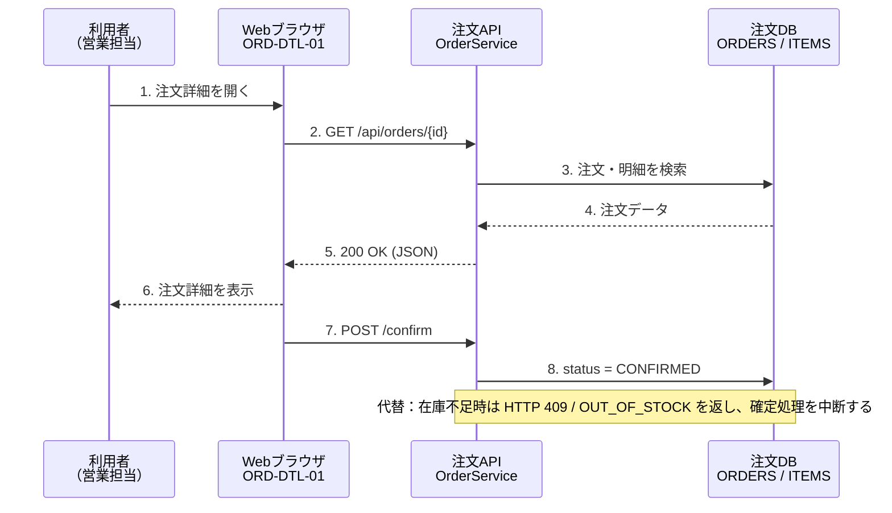
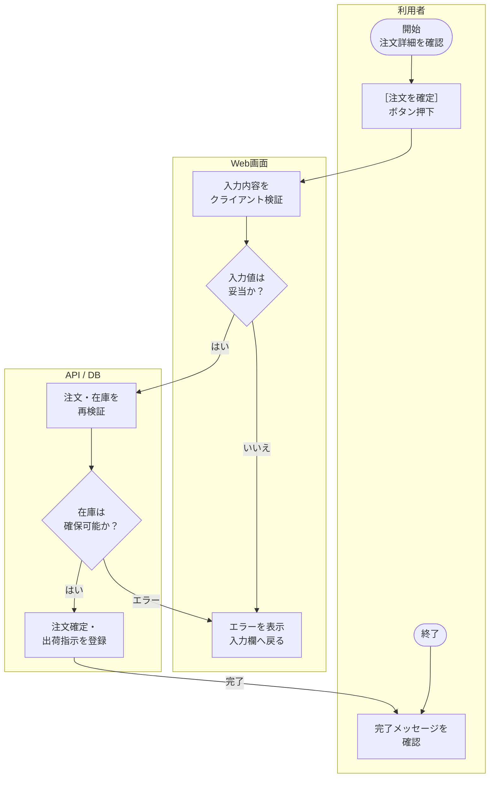

<!--drmd:partition-begin id=sheet-設計概要 baseline_nodes=59-->
## 設計概要

<!--drmd:sheet-table range=A1:L16 source-columns=A,B,C,D,E,F,G,H,I,K,L source-rows=1,3,5,7,8,9,10,11,12,13,14,16 baseline_nodes=59 editability=cell-grid operations=replace-cell constraints=preserve-range,preserve-addresses,no-insert-delete,safe-formula-->
| 受注管理システム　基本設計書 |  |  |  |  |  |  |  |  |  |  |
| --- | --- | --- | --- | --- | --- | --- | --- | --- | --- | --- |
| Excel方眼紙・シーケンス・業務フロー・貼付画面・OCRを含むDRMD変換確認用サンプル |  |  |  |  |  |  |  |  |  |  |
| 文書ID | DOC-ORD-BD-001 |  |  | 版数 | 1.2 |  | 作成日 | 46256 | 作成者 | 開発1課 |
| 設計・試験進捗（入力値は青、計算セルは緑） |  |  |  |  |  |  |  |  |  |  |
| 成果物 | 予定件数 | 完了件数 | 完了率 | 工数(h) | 単価(円) | 金額(円) |  | DRMD確認ポイント |  |  |
| API基本設計 | 12 | 12 | `=C9/B9` → 1 | 24 | 7500 | `=E9*F9` → 180000 |  | 数式セル数 | `=COUNTA(D9:D12)+COUNTA(G9:G12)+COUNTA(B12:C12)+COUNTA(E12)` → 11 |  |
| 画面基本設計 | 8 | 6 | `=C10/B10` → 0.75 | 18 | 7500 | `=E10*F10` → 135000 |  | 総予定件数 | `=B12` → 30 |  |
| 結合試験項目 | 10 | 7 | `=C11/B11` → 0.7 | 30 | 6500 | `=E11*F11` → 195000 |  | 総完了件数 | `=C12` → 25 |  |
| 合計 / 総合 | `=SUM(B9:B11)` → 30 | `=SUM(C9:C11)` → 25 | `=C12/B12` → 0.8333333333333334 | `=SUM(E9:E11)` → 72 |  | `=SUM(G9:G11)` → 510000 |  | 総合完了率 | `=D12` → 0.8333333333333334 |  |
|  |  |  |  |  |  |  |  | 総金額 | `=G12` → 510000 |  |
|  |  |  |  |  |  |  |  | OCR期待行数 | `=COUNTA('OCR期待値'!B5:B29)` → 25 |  |
| 凡例：青字＝入力値／緑字＝数式。DRMDのMarkdownでは数式セルを `=式` → 計算結果 の形式で投影し、計算結果側は参照専用です。 |  |  |  |  |  |  |  |  |  |  |

<!--drmd:partition-end id=sheet-設計概要 baseline_nodes=59-->
<!--drmd:partition-begin id=sheet-シーケンス図 baseline_nodes=124-->
## シーケンス図

<!--drmd:block id=n_c796895767bfc1c5 kind=diagram editability=protected operations=none constraints=preserve-marker,preserve-content language=mermaid diagram-type=sequence-->

<!--drmd:sheet-table range=A1:V33 source-columns=A,B,D,E,H,J,K,N,P,Q,T,V source-rows=1,3,4,7,8,9,10,11,12,13,14,15,16,17,18,19,20,21,22,23,24,25,26,27,28,29,30,31,32,33 baseline_nodes=123 editability=cell-grid operations=replace-cell constraints=preserve-range,preserve-addresses,no-insert-delete,safe-formula-->
| 注文詳細表示・確定　シーケンス図 |  |  |  |  |  |  |  |  |  |  |  |
| --- | --- | --- | --- | --- | --- | --- | --- | --- | --- | --- | --- |
| セル結合・細幅列・罫線・矢印文字で作成した、典型的なExcel方眼紙形式 |  |  |  |  |  |  |  |  |  |  |  |
|  | 利用者 （営業担当） |  |  | Webブラウザ ORD-DTL-01 |  |  | 注文API OrderService |  |  | 注文DB ORDERS / ITEMS |  |
|  |  | ┆ |  |  | ┆ |  |  | ┆ |  |  | ┆ |
|  |  | ┆ | 1. 注文詳細を開く　────────▶ |  | ┆ |  |  | ┆ |  |  | ┆ |
|  |  | ┆ |  |  | ┆ |  |  | ┆ |  |  | ┆ |
|  |  | ┆ |  |  | ┆ |  |  | ┆ |  |  | ┆ |
|  |  | ┆ |  |  | ┆ | 2. GET /api/orders/{id}　────────▶ |  | ┆ |  |  | ┆ |
|  |  | ┆ |  |  | ┆ |  |  | ┆ |  |  | ┆ |
|  |  | ┆ |  |  | ┆ |  |  | ┆ |  |  | ┆ |
|  |  | ┆ |  |  | ┆ |  |  | ┆ | 3. 注文・明細を検索　────────▶ |  | ┆ |
|  |  | ┆ |  |  | ┆ |  |  | ┆ |  |  | ┆ |
|  |  | ┆ |  |  | ┆ |  |  | ┆ |  |  | ┆ |
|  |  | ┆ |  |  | ┆ |  |  | ┆ | 4. 注文データ　◀──────── |  | ┆ |
|  |  | ┆ |  |  | ┆ |  |  | ┆ |  |  | ┆ |
|  |  | ┆ |  |  | ┆ |  |  | ┆ |  |  | ┆ |
|  |  | ┆ |  |  | ┆ | 5. 200 OK (JSON)　◀──────── |  | ┆ |  |  | ┆ |
|  |  | ┆ |  |  | ┆ |  |  | ┆ |  |  | ┆ |
|  |  | ┆ |  |  | ┆ |  |  | ┆ |  |  | ┆ |
|  |  | ┆ | 6. 注文詳細を表示　◀──────── |  | ┆ |  |  | ┆ |  |  | ┆ |
|  |  | ┆ |  |  | ┆ |  |  | ┆ |  |  | ┆ |
|  |  | ┆ |  |  | ┆ |  |  | ┆ |  |  | ┆ |
|  |  | ┆ |  |  | ┆ | 7. POST /confirm　────────▶ |  | ┆ |  |  | ┆ |
|  |  | ┆ |  |  | ┆ |  |  | ┆ |  |  | ┆ |
|  |  | ┆ |  |  | ┆ |  |  | ┆ |  |  | ┆ |
|  |  | ┆ |  |  | ┆ |  |  | ┆ | 8. status = CONFIRMED　────────▶ |  | ┆ |
|  |  | ┆ |  |  | ┆ |  |  | ┆ |  |  | ┆ |
|  |  | ┆ |  |  | ┆ |  |  | ┆ |  |  | ┆ |
|  |  | ┆ |  |  | ┆ |  | 代替：在庫不足時は HTTP 409 / OUT_OF_STOCK を返し、確定処理を中断する | ┆ |  |  | ┆ |
|  |  | ┆ |  |  | ┆ |  |  | ┆ |  |  | ┆ |

<!--drmd:partition-end id=sheet-シーケンス図 baseline_nodes=124-->
<!--drmd:partition-begin id=sheet-業務フロー baseline_nodes=27-->
## 業務フロー

<!--drmd:block id=n_cc4840ca040d3233 kind=diagram editability=protected operations=none constraints=preserve-marker,preserve-content language=mermaid diagram-type=flowchart-->

<!--drmd:sheet-table range=A1:O32 source-columns=A,B,C,F,G,H,I,L,M,N,O source-rows=1,3,4,6,9,11,12,14,16,17,20,22,23,26,28,29,31,32 baseline_nodes=26 editability=cell-grid operations=replace-cell constraints=preserve-range,preserve-addresses,no-insert-delete,safe-formula-->
| 注文確定　業務フロー |  |  |  |  |  |  |  |  |  |  |
| --- | --- | --- | --- | --- | --- | --- | --- | --- | --- | --- |
| 部門別レーンと結合セルで再現したフローチャート |  |  |  |  |  |  |  |  |  |  |
| 利用者 |  |  |  | Web画面 |  |  |  | API / DB |  |  |
|  | 開始 注文詳細を確認 |  |  |  |  |  |  |  |  |  |
|  |  | ↓ |  |  |  |  |  |  |  |  |
|  | ［注文を確定］ ボタン押下 |  |  |  | 入力内容を クライアント検証 |  |  |  |  |  |
|  |  |  | → |  |  |  |  |  |  |  |
|  |  |  |  |  |  | ↓ |  |  |  |  |
|  |  |  |  |  | ◇ 入力値は 妥当か？ ◇ |  |  |  | 注文・在庫を 再検証 |  |
|  |  |  |  |  |  |  | はい → |  |  |  |
|  |  |  |  |  |  | いいえ ↓ |  |  |  | ↓ |
|  |  |  |  |  | エラーを表示 入力欄へ戻る |  |  |  | ◇ 在庫は 確保可能か？ ◇ |  |
|  |  |  |  |  |  |  | ← エラー |  |  |  |
|  |  |  |  |  |  |  |  | いいえ：在庫不足エラーを返却 |  | はい ↓ |
|  | 完了メッセージを 確認 |  |  |  |  |  |  |  | 注文確定・ 出荷指示を登録 |  |
|  |  |  |  |  |  |  | ← 完了 |  |  |  |
|  |  | ↓ |  |  |  |  |  |  |  |  |
|  | 終了 |  |  |  |  |  |  |  |  |  |

<!--drmd:partition-end id=sheet-業務フロー baseline_nodes=27-->
<!--drmd:partition-begin id=sheet-OCR期待値 baseline_nodes=88-->
## OCR期待値

<!--drmd:sheet-table range=A1:F29 source-columns=A,B,C,E,F source-rows=1,3,4,5,6,7,8,9,10,11,12,13,14,15,16,17,18,19,20,21,22,23,24,25,26,27,28,29 baseline_nodes=88 editability=cell-grid operations=replace-cell constraints=preserve-range,preserve-addresses,no-insert-delete,safe-formula-->
| OCR評価用 正解データ |  |  |  |  |
| --- | --- | --- | --- | --- |
| 画面設計シートに貼り付けたスクリーンショット内の主要文字列。OCR結果との文字誤り率（CER）算定に使用する |  |  |  |  |
| No. | 期待文字列 | 難易度・観点 |  |  |
| 1 | 注文管理システム | 大見出し | 集計 | 値 |
| 2 | 営業部 山田 太郎 ログアウト | 空白・区切り | 期待行数 | `=COUNTA(B5:B29)` → 25 |
| 3 | ダッシュボード | 白抜き文字 | 評価対象 | 主要25行 |
| 4 | 注文検索 | 白抜き・太字 | 評価指標 | 文字誤り率(CER) |
| 5 | 在庫照会 | 白抜き文字 |  |  |
| 6 | 出荷管理 | 白抜き文字 |  |  |
| 7 | マスタ管理 | 白抜き文字 |  |  |
| 8 | 注文詳細 | 見出し |  |  |
| 9 | 基本情報 | 見出し |  |  |
| 10 | 出荷準備中 | 小型バッジ |  |  |
| 11 | 注文番号 ORD-2026-00128 | 英数字・ハイフン |  |  |
| 12 | 注文日 2026年8月22日 | 和文日付 |  |  |
| 13 | 顧客名 株式会社サンプル商事 | 漢字・カナ |  |  |
| 14 | 担当者 佐藤 花子 | 人名・空白 |  |  |
| 15 | 配送先 東京都千代田区丸の内1-2-3 | 住所・数字 |  |  |
| 16 | 支払方法 請求書払い（月末締め） | 括弧 |  |  |
| 17 | 注文明細 | 見出し |  |  |
| 18 | 商品コード 商品名 数量 単価 金額 | 表ヘッダー |  |  |
| 19 | PC-AX104 業務用ノートPC 14型 2 48,000円 96,000円 | 英数字・金額 |  |  |
| 20 | AC-DK210 USB-Cドッキングステーション 2 12,000円 24,000円 | 長いカナ |  |  |
| 21 | SV-SET01 初期設定サービス 2 4,200円 8,400円 | 英数字・金額 |  |  |
| 22 | 合計金額（税込） 128,400円 | 強調金額 |  |  |
| 23 | キャンセル | ボタン |  |  |
| 24 | 注文を確定 | 白抜きボタン |  |  |
| 25 | 最終更新: 2026/08/22 14:35 画面ID: ORD-DTL-01 | 小さい低コントラスト文字 |  |  |

<!--drmd:partition-end id=sheet-OCR期待値 baseline_nodes=88-->
<!--drmd:partition-begin id=sheet-画面設計 baseline_nodes=21-->
## 画面設計

<!--drmd:sheet-table range=A1:R5 source-columns=A,B,E,F,J,K,N,O,Q,R source-rows=1,3,4,5 baseline_nodes=13 editability=cell-grid operations=replace-cell constraints=preserve-range,preserve-addresses,no-insert-delete,safe-formula-->
| 画面基本設計　注文詳細（ORD-DTL-01） |  |  |  |  |  |  |  |  |  |
| --- | --- | --- | --- | --- | --- | --- | --- | --- | --- |
| Excelセル方眼紙の上に画面キャプチャを貼り付けた実務風レイアウト。貼付画像はDRMDのアセット抽出・OCR対象 |  |  |  |  |  |  |  |  |  |
| 画面ID | ORD-DTL-01 | 機能名 | 注文詳細表示・確定 | 権限 | 営業担当 | 更新方式 | 同期 | 備考 | 在庫再検証あり |
| 貼付画面（OCR対象） |  |  |  |  |  |  |  |  |  |

<!--drmd:block id=n_410197bc7a3cf473 kind=image editability=protected operations=none constraints=preserve-marker,preserve-content-->

<!--drmd:block id=n_8defa3a6d6b1ea2c kind=image-text editability=annotation-only operations=replace-annotation constraints=original-unchanged-->
注文管理システム
MAIN MENU
ダッシュボード
注文検索
在庫照会
出荷管理
マスタ管理
ホーム ＞ 注文検索 ＞ 注文詳細
注文詳細
基本情報
注文番号
願客名
配送先
注文明細
商品コード
PC-AX104
AC-DK210
SV-SETO1
ORD-2026-00128
株式会社サンプル商事
東京都千代田区丸の内1-2-3
商品名
業務用ノートPC 14型
USB-Cドッキングステーション
初期設定サービス
注文日
担当者
支払方法
数量
2
2
2
営業部 山田 太郎 1 ログアウト
出荷準備中
2026年8月22日
佐藤 花子
請求書払い（月末締め）
単価
金額
48,000円
96,000円
12,000円
24,000円
4,200円
8,400円
合計金額（税込）
128,400円
キャンセル
注文を確定
最終更新： 2026/08/22 14:35 曲面ID:ORD-DTL-01

<!--drmd:sheet-table range=A36:B42 source-columns=A,B source-rows=36,37,41,42 baseline_nodes=6 editability=cell-grid operations=replace-cell constraints=preserve-range,preserve-addresses,no-insert-delete,safe-formula-->
| OCR評価ポイント |  |
| --- | --- |
| 日本語見出し／白抜きナビ／英数字ID／カナ長文／住所／金額／括弧／小さい低コントラスト文字を含む。正解文字列は「OCR期待値」シートを参照。 |  |
| 設計メモ | 確定ボタン押下時は注文・在庫を再検証し、競合時は409を表示する。 |
| OCR対象画像 | xl/media/image1.png |

<!--drmd:partition-end id=sheet-画面設計 baseline_nodes=21-->
<!--drmd:document-end id=doc_b47831d53e0ae5e8 partitions=5-->
